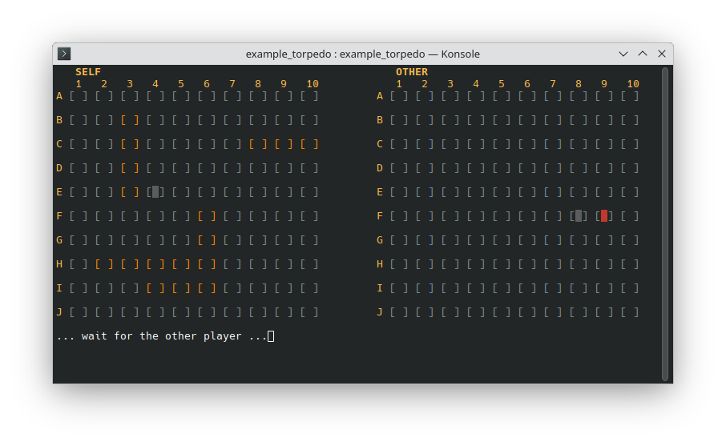

Mini Game Networking
--------------------

Communication toolkit for tiny games.

## API

- `join_session`
- `reset_session`
- `start_session`
- `end_session`
- `is_gamer_turn`
- `is_game_on`
- `send_update`
- `get_previous_round_updates`
- `send_message`
- `fetch_all_messages`
- `next_gamer`

### Example: torpedo

